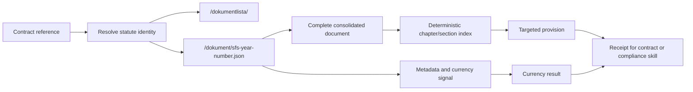

# Riksdagen API map — first orientation

This is a learning map, not a complete API specification. It records the small surface
we need before adding connector logic.

## The map



## Endpoint map

| Surface | What it is for | First test | Limitation to record |
|---|---|---|---|
| `/dokumentlista/` | Search and filter when the SFS number is unknown | Search for `aktiebolagslag` and inspect the returned identifiers | Search ranking is not identity proof; confirm the title and SFS number |
| `/dokument/{id}.json` | Known-document metadata plus consolidated text | Fetch `sfs-2005-551` | Document-level response; not yet a provision endpoint |
| `/dokument/{id}.text` | Plain-text rendering | Compare with the JSON text field | Long responses may be truncated by a client even when the source has more text |
| `/dokument/{id}.html` | Human-readable rendering, contents links and paragraph anchors | Check ABL chapters, paragraph anchors and source header | Use publisher structure as a machine-readable boundary signal; do not assume every Act exposes the same markers |
| `/dokumentstatus/{id}` | Status-shaped document response | Compare with the direct document response | Confirm whether it adds anything needed before adopting it |

Known SFS identifiers use the form `sfs-{year}-{number}`. For example, SFS 2005:551
becomes `sfs-2005-551`.

## Response facts to preserve

The first receipt should preserve:

- requested identifier;
- publisher URL and endpoint format;
- title and SFS number;
- `Ändrad: t.o.m. SFS ...` when present;
- retrieval time;
- HTTP status and response size;
- content SHA-256 hash;
- whether the complete document was cached;
- locator checks and their result;
- warnings or failure reason.

The first live test also shows a format difference worth keeping visible: JSON exposes a
compact `subtitel` value such as `t.o.m. SFS 2026:783`, while `.text` exposes the fuller
header `Ändrad: t.o.m. SFS 2026:783`. The adapter must preserve which representation
supplied each fact rather than assuming all formats are interchangeable.

The raw `.html` endpoint response and the `document.html` representation embedded in the
JSON response may also have different transport hashes even when they describe the same
source. The orientation receipt records the raw endpoint hash; the provision packet records
the embedded HTML hash used by the index. Keep those fields distinct rather than treating a
hash difference alone as a legal-text change.

The consolidated text is a useful machine-readable working copy. It should still be
labelled as a consolidation and linked back to the official source hierarchy.

The first index is intentionally conservative, but text line breaks alone are not a
complete source model. The connector must compare the text index with the publisher's
structural markers and mark a source `review_required` or `unknown` when the views do not
agree. See [SOURCE-CAPABILITY.md](SOURCE-CAPABILITY.md) for the promotion rule.

## Long-document path

```text
full JSON response
  → immutable local snapshot
  → headings and section offsets
  → exact locator request
  → small provision result
```

Do not send the complete ABL to an agent and ask it to find a section. The first index
can use deterministic Swedish headings and section patterns, including chapterless
statutes such as LAS. A later semantic search layer may help discovery, but it must not
replace exact addressing.

## Access is not indexing

The API call and the local lookup do different jobs:

| Event | What happens | Why it is kept separate |
|---|---|---|
| Orientation or refresh | Retrieve the official JSON/text/HTML response and store a timestamped snapshot | Establishes which source version was obtained |
| Index build | Compare structural signals and calculate section offsets and hashes | Makes long text safely addressable |
| Provision lookup | Read the cached snapshot and index, then return a small packet | Avoids repeated network calls and keeps the assistant context small |
| Staleness comparison | Retrieve or receive a fresh source and compare it with a pinned receipt | Tests change explicitly rather than silently replacing the baseline |

“Open API” therefore means that the source can be accessed. It does not mean that every
client should call it for every question, nor that the response can be safely searched by
line breaks alone.

## EU adapter hypothesis

The EU extension should reuse the provider-neutral packet ideas—source identity, retrieval
time, content hash, locator, evidence and uncertainty—but must have its own adapter and
index tests. We should first inspect the relevant EUR-Lex representation and identify its
stable article, paragraph and version signals. It may expose better article-level structure
than the Swedish SFS text, or it may introduce different boundary and language issues. Until
tested, the Swedish `chapter/section` parser should not be reused for it.

## API questions still open

- Does every relevant SFS response expose the same currency field?
- How are unamended statutes represented?
- Which characters and heading forms appear in long statutes?
- What happens when a requested section is not found?
- Which source URL should be used for the authentic SFS document?
- How should an amending act and a consolidated base statute be related?
