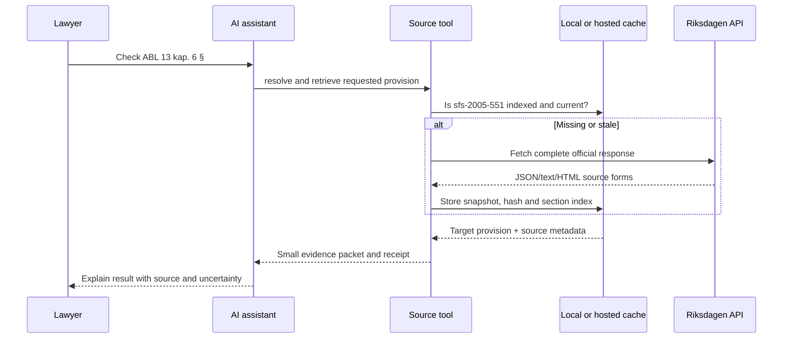

# How the long-document layer reaches an AI assistant

The assistant should not receive a whole Act in its context. It should call a source
tool that owns retrieval, caching and provision addressing.

## The runtime flow



## What gets shipped

The public package should contain:

- the Riksdagen adapter;
- the cache and section-index code;
- the source capability profile and completeness audit;
- a small source descriptor;
- the tool interface;
- the assistant skill/instructions;
- synthetic fixtures and tests;
- the API map, README and lawyer explanation.
- the Apache 2.0 licence and the project notice.

It should not contain a complete Swedish legislation corpus. At first use, the runtime
retrieves the requested source from the official endpoint and stores it locally or in a
controlled service cache.

## Three ways to use the package

### 1. Local assistant

The user installs the package and the assistant is configured to call a local tool
server. The complete Act stays on the user's machine. The assistant receives only the
requested section and receipt.

This is the best first open-source mode because it is inspectable and keeps source
material under the user's control.

### 2. Local command or library

The user runs the retrieval/index command directly. An assistant can call the command or
the user can inspect its JSON result. This is the simplest debugging and teaching mode;
it does not require an AI integration.

### 3. Hosted source service

A hosted service owns the cache and index. Assistants call it over an authenticated API.
This is convenient for teams, but it creates operational questions about availability,
source retention, access control, logging, data residency and trust. It is a later
deployment option, not a prerequisite for the public pilot.

## Minimal assistant tool contract

The first real interface should be small:

```text
get_provision(
  authority_id: "sfs-2005-551",
  locator: "13 kap. 6 §"
) → {
  status: "found" | "not_found" | "ambiguous" | "unknown",
  text: "...",
  source_id: "2005:551",
  locator: "13 kap. 6 §",
  source_url: "...",
  retrieved_at: "...",
  consolidation_signal: "...",
  content_sha256: "...",
  receipt_id: "..."
}
```

The assistant skill should instruct the model to:

1. identify the authority before asking for text;
2. call the source tool for a legal citation;
3. never replace a failed tool call with an unlabelled free-text web search;
4. show `unknown` when the source or provision cannot be confirmed;
5. show `ambiguous` when the source contains more than one plausible passage for the
   requested address;
6. distinguish retrieved text from legal interpretation;
7. point to the source receipt.

For a staleness check, the assistant should call a comparison operation against the
pinned receipt. `current` means the complete retrieved text matches the pin; `stale`
means the text or publisher currency marker changed; `unknown` means the comparison could
not establish a reliable result. The comparison must not silently replace the pin.

## Why the skill is still needed

The code knows how to fetch and address the source. The skill tells the assistant when
to use it, how to explain the result, and when to stop. A different assistant can use
the same source tool with a different skill, contract workflow or compliance workflow.
