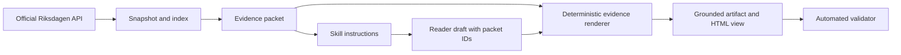

# The grounding harness

The skill is a behavioural contract. The harness is the part that tests whether the
assistant stayed attached to the evidence.



## The division of work

| Layer | Job | What it must not pretend to do |
|---|---|---|
| Connector | Fetch, cache, index, hash and compare official source material | Interpret the law |
| Packet | Carry a small, inspectable piece of source evidence | Prove applicability |
| Skill | Tell the assistant when to call, stop and disclose the source path | Guarantee perfect output by instruction alone |
| Reader draft | Explain the supplied material in plain English and link claims to packet IDs | Recreate authoritative source fields |
| Renderer | Add exact packet text, hashes, offsets and provenance | Repair an unsupported claim silently |
| Validator | Reject unknown IDs, changed hashes and missing disclosure | Replace human legal review |

This is why the Claude parity result mattered. Its prose was useful, but its evidence
layer was incomplete. The v0.2 pattern gives the assistant room to explain while keeping
the inspectable source record deterministic.

## Model output versus source output

A model draft can contain:

```json
{
  "claim_id": "C01",
  "text": "The board has an active role in organising and supervising the company.",
  "boundary": "The packet does not decide whether a particular board's controls are adequate.",
  "packet_ids": ["P02"]
}
```

The renderer then adds the Swedish text, exact locator, section hash, snapshot and source
links from `P02`. The model's English sentence remains visible as an explanation, not
silently upgraded into statutory text.

The same contract supports `output_language: "sv"`. In that case the model writes plain
Swedish instead of plain English, while the renderer still copies the Swedish packet text
and provenance unchanged. Language changes the reader layer, not the evidence layer.

## The practical lesson

Grounding is not only a retrieval problem. It is a continuity problem: the link between
source, explanation and review must survive the whole workflow. Packet IDs are the small
joining key that lets flexible language and deterministic evidence work together.
