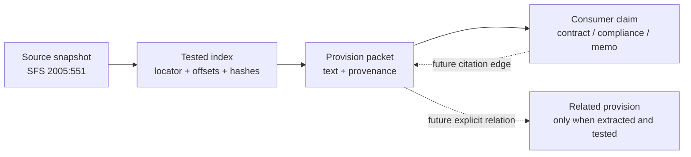

# Index and reference model

## The short answer

Yes. The small index file is useful beyond the first `get_provision` command. It is a
compact navigation map over a separately held source snapshot:

```text
source snapshot = the ground truth we preserve
index            = the tested map into that source
packet           = the small evidence result sent to an assistant
```

The index is not the law, a summary, or a semantic search engine. It tells the connector
where a provision begins and ends, which source snapshot it belongs to, and whether the
source passed the structural checks needed for safe addressing.

## What is in the current index

For each supported SFS source, the index records:

- source identity, title, SFS number and consolidation signal;
- source text and HTML hashes;
- the index version and offset unit;
- the capability result and any structural issues;
- each addressable section's locator, publisher anchor, line range, character offsets and
  section hash.

The section text is not duplicated into the index. The offsets point into the complete,
locally held `document.text` snapshot. A lookup therefore follows this sequence:

```text
requested citation
  → index lookup
  → offset slice from the held source
  → section hash check
  → evidence packet
```

This is why a long Act does not need to be placed wholesale into an assistant's context.
The assistant receives the small result, while the connector retains enough material to
reproduce and check it.

## Why this is useful for agents

The index provides four practical benefits:

1. **Less context:** the agent sees the requested provision and evidence, not the whole Act.
2. **Less repeated work:** a cache hit can reuse the source and index without another API
   call; a deliberate refresh can be run when currency matters.
3. **More deterministic navigation:** the agent does not have to guess which occurrence of a
   section-shaped line is the legal provision.
4. **A visible failure path:** a missing, ambiguous or structurally unsupported address can
   become `not_found`, `ambiguous`, `review_required` or `unknown` rather than a plausible
   answer.

The index is therefore a job-to-be-done aid for the connector. It is not currently shipped
as a general text-snippet service, and the paused snippet-review use case is not part of the
public release claim.

## Graph-ready, without claiming a graph

The current records already have the beginnings of a useful reference model:



The last two dotted edges are a design direction, not current functionality. A future
reference layer could represent relations such as:

- a memo claim cites a provision;
- one provision expressly cross-references another;
- a contract citation was checked against a particular receipt;
- a later retrieval supersedes an earlier pinned receipt.

Those relations should be created from explicit, testable evidence—not inferred merely
because two passages look semantically related. This lets us add graph-like navigation later
without turning the first release into an unexplained knowledge graph.

## How higher-level overlays would use it

The same grounded packet can support different presentations while the source layer stays
stable:

| Overlay | Uses the packet to show | Does not get from the packet alone |
|---|---|---|
| Contract reference check | citation, source address, current/stale/unknown result | applicability or drafting advice |
| Compliance check | authority identity, version marker and refresh status | the organisation's compliance conclusion |
| Evidence-linked HTML memo | clickable quote, official link and receipt details | a conclusion that the provision applies |
| Word review | a proposed citation note or review flag | permission to silently rewrite the document |

These are consumer workflows, not additional skills. The public build should keep one
grounding skill and make the overlay boundary visible.

## Future tests for this layer

Before exposing an index through a hosted service or a richer contract-review build, test:

1. every index entry points inside the matching source hash;
2. every extracted section reproduces its section hash;
3. an index made for an older source or index version is rebuilt;
4. ambiguous and `review_required` sources cannot produce a confirmed provision;
5. a consumer can retain the packet-to-document location when rendering a memo or review;
6. explicit cross-reference edges preserve both the originating provision and the target
   locator.

The public claim can then remain modest and accurate: this is a tested source-navigation
and evidence foundation for Swedish statutory references, with extension points above it.
