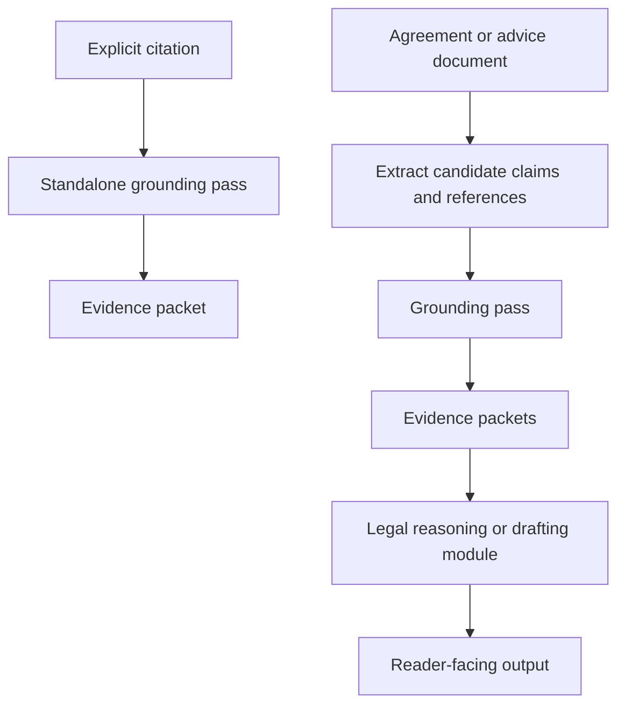

# Wiring and operating modes

This note makes visible which part of the build is responsible for an answer.

## The layers

```text
Riksdagen source
  → connector: fetch, store, index, hash and compare
  → evidence packet: small, inspectable JSON result
  → skill: source discipline and explanation rules
  → reader draft: plain-English claims linked to packet IDs
  → deterministic renderer: exact source text and provenance
  → consumer: chat check, contract audit, Word review or compliance workflow
```

The portable skill does not contain the connector. Installing the skill in an assistant
does not automatically install a live Riksdagen API connection.

## Modes

### Strict source mode

Use for one statutory reference or a staleness check.

The assistant may confirm:

- authority and SFS identity;
- requested and canonical locator;
- packet status;
- targeted source text;
- consolidation marker, timing, hashes and offsets;
- whether a pinned source changed.

It may not decide applicability, legal effect, interpretation or drafting consequences.

## Standalone pass versus composed workflow

The grounding skill can be used on its own or placed inside a larger legal workflow.
These are two different uses of the same source layer:



### Standalone grounding pass

Use this when the user already has a reference:

```text
Aktiebolagslag (2005:551), 13 kap. 6 §
  → source packet
  → source text, currency signal, hashes and uncertainty
```

This is what the current skill is designed to do. It does not scan a document, decide
whether the provision applies, or recommend drafting.

### Composed workflow

A contract, compliance or advice skill may use the grounding pass as one stage:

1. read the document and extract candidate claims or references;
2. label those candidates as proposed, not confirmed;
3. send confirmed or reviewable candidates to the source connector;
4. compare the document claim with the returned source packet;
5. pass the evidence and comparison to a separate legal reasoning or drafting module;
6. render the result for the intended reader.

The first step is document reading. The fourth step is claim evaluation. Neither should
be silently treated as source confirmation.

The evidence packet is the interface between the stages. A parent workflow can consume
the packet without installing a second copy of the Riksdagen connector. Conversely, the
grounding skill can remain useful without any parent workflow.

### Review-assist mode

Use for a contract, article or policy containing several legal claims.

This is a separate consumer workflow. It may:

- identify candidate references and claims;
- map them to source packets;
- classify a claim as apparently supported, unsupported or over-specific;
- propose wording for human review.

It must not present a model assessment as if it were source text. Each finding should point
to a packet or say that it remains ungrounded. Proposed document edits should remain visible
and reviewable.

### Grounded reader-draft harness

For a readable explanation, the assistant should return claims with packet IDs rather than
reproducing the authoritative source fields itself. The renderer then copies the exact
packet text, locator, hash and provenance from the packet set. This keeps model flexibility
in the reader layer while making the evidence layer deterministic.

The v0.2 ABL example implements this in `connector/render_grounded_claims.mjs` and
`examples/abl-primer/build_grounded_artifact.mjs`. It is an optional consumer pattern, not
a replacement for strict source mode.

## Mandatory run disclosure

Every run should disclose:

```text
mode: strict source | review-assist
source_path: connector packet | packet-only | direct official fetch | no source
connector_receipt: identifier or not used
capability_audit: supported | review_required | unsupported | unavailable
edit_status: none | proposed only | applied with user instruction
retrieval_mode: live fetch | cached snapshot | unknown
cache_action: fetched | reused | rebuilt | not used
assistant_memory_used_as_evidence: no
```

### Why this matters

A direct fetch from the official Riksdagen page can be useful, but it is not evidence that
the local connector ran. A packet-only test can be useful, but it is not a live retrieval.
The source path changes what the result can claim.

In the current pilot, the normal provision lookup is `cached snapshot`: the connector reads
the locally stored complete source and its index. The Riksdagen API is called during source
orientation or an explicit refresh. A skill installation alone does not create a live API
connection, and the assistant's learned knowledge or conversation memory is not a substitute
for a packet.

## Current project status

The source connector and portable skill are separate alpha components. The public examples
demonstrate strict source use, packet-only explanation and a deterministic grounded-reader
pattern. Whole-document or Word review remains an experimental consumer workflow, not a
shipped integration. Any future integration test must use connector packets and visible run
disclosure before it can be described as source-grounded.
