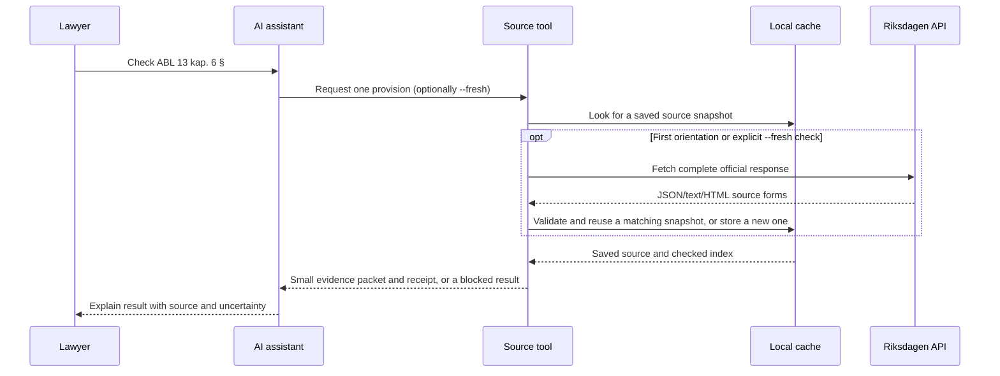

# How the long-document layer reaches an AI assistant

The assistant should not receive a whole Act in its context. It should call a source
tool that owns retrieval, caching and provision addressing.

## The runtime flow



When the source map is held at `review_required`, the local connector can prepare a
review page for one reproducible locator. A saved decision goes back through the same
validator before that locator is retried. The [local review guide](LOCATOR-REVIEW-GUIDE.md)
shows the page and file fallback; the assistant does not need a separate review UI.

## What gets shipped

The public package should contain:

- the Riksdagen adapter;
- the cache and section-index code;
- the source capability profile and completeness audit;
- a small source descriptor;
- the tool interface;
- the assistant skill/instructions;
- synthetic fixtures and tests;
- the API map, README and lawyer explanation;
- the Apache 2.0 licence and the project notice.

It should not contain a complete Swedish legislation corpus. Source orientation or an
explicit `--fresh` lookup retrieves one identified Act and stores it locally. A plain
cached lookup first needs that local source snapshot.

## Three ways to use the package

### 1. Local assistant with command access

The user installs the connector, and the assistant runs its Node commands in the local
project folder. The complete Act stays on that machine. The assistant receives a small
packet or a labelled blocked-source observation. A compatible skill may be installed
separately to guide how the assistant explains the result.

This is the best first open-source mode because it is inspectable and keeps source
material under the user's control.

### 2. Local command

The user runs the retrieval/index command directly. An assistant can call the command or
the user can inspect its JSON result. This is the simplest debugging and teaching mode;
it does not require an AI integration.

### 3. Hosted source service (future option)

A hosted service owns the cache and index. Assistants call it over an authenticated API.
This is convenient for teams, but it creates operational questions about availability,
source retention, access control, logging, data residency and trust. It is a later
deployment option, not a prerequisite for the public pilot.

## Minimal assistant packet boundary

The current Node command returns a richer JSON packet. The compact sketch below shows
the fields an assistant needs to explain a result; the
[packet contract](../skill/sv-legal-source-grounding/references/packet-contract.md) defines
the actual fields and their conditions.

```text
get_provision(
  authority_id: "sfs-2005-551",
  locator: "13 kap. 6 §"
) → {
  status: "found" | "not_found" | "ambiguous" | "unknown",
  text: "..." when found,
  review_action.source_observation: reading-only text when available on a blocked result,
  source_check: fresh comparison details when --fresh was used,
  source_id: "2005:551",
  locator: "13 kap. 6 §",
  source_url: "...",
  retrieved_at: "...",
  consolidation_signal: "...",
  source_text_sha256: "...",
  run_receipt: "..." when using the command output
}
```

The assistant skill should instruct the model to:

1. identify the authority before asking for text;
2. call the source tool for a legal citation;
3. never replace a failed tool call with an unlabelled free-text web search;
4. show `unknown` when the source or provision cannot be confirmed;
5. show `ambiguous` when the source contains more than one plausible passage for the
   requested address;
6. distinguish retrieved text from legal interpretation;
7. point to the source receipt.

For a staleness check, the assistant should call a comparison operation against the
pinned receipt. `current` means the checked source matches the pin on the fields the
receipt records; `stale` means the text, publisher HTML when available, or currency
marker changed; `unknown` means the comparison could not establish a reliable result.
The comparison must not silently replace the pin.

## Why the skill is still needed

The code knows how to fetch and address the source. The skill tells the assistant when
to use it, how to explain the result, and when to stop. A different assistant can use
the same source tool with a different skill, contract workflow or compliance workflow.
